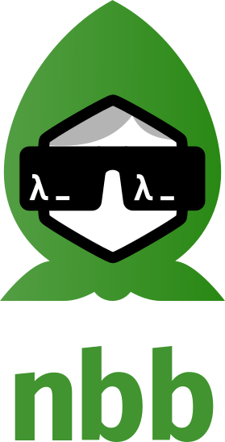
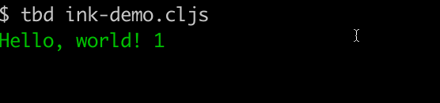

Not [babashka](https://babashka.org/). Node.js babashka!?

Ad-hoc CLJS scripting on Node.js.

## Try it out

Run `npx nbb` to run nbb on your own machine, or try it in a browser on
[Replit](https://replit.com/@eccentric-j/Node-Babashka-With-Redefs-Examples#src/cli/core.cljs)!

## Goals and features

Nbb's main goal is to make it _easy_ to get started with ad hoc CLJS scripting
on Node.js.

Additional goals and features are:

- Fast startup without relying on a custom version of Node.js.
- Small artifact (current size is around 1.2MB).
- First class [macros](#macros).
- Support building small TUI apps using [Reagent](#reagent).
- Complement [babashka](https://babashka.org/) with libraries from the Node.js ecosystem.

## Community

- Submit bugs at [Github Issues](https://github.com/borkdude/nbb/issues).
- Join [Github Discussions](https://github.com/borkdude/nbb/discussions) for proposing ideas, show and tell and Q&A.
-  Join the [channel](https://app.slack.com/client/T03RZGPFR/C029PTWD3HR) on Clojurians Slack.
- Follow news or tweet using the Twitter hashtag
  [#nbbjs](https://twitter.com/hashtag/nbbjs?f=live).

## Requirements

Nbb requires Node.js v14 or newer.

Additionally, in the case of downloading [Clojure
dependencies](#Clojure-dependencies), it requires the installation of
[babashka](https://babashka.org/).

## How does this tool work?

CLJS code is evaluated through [SCI](https://github.com/borkdude/sci), the same
interpreter that powers [babashka](https://babashka.org/). Because SCI works
with advanced compilation, the bundle size, especially when combined with other
dependencies, is smaller than what you get with self-hosted CLJS. That makes
startup faster. The trade-off is that execution is less performant and that only
a subset of CLJS is available (e.g. no deftype, yet).

## Usage

Install `nbb` from NPM:

```
$ npm install nbb -g
```

Omit `-g` for a local install.

Try out an expression:

``` clojure
$ nbb -e '(+ 1 2 3)'
6
```

And then install some other NPM libraries to use in the script. E.g. with the following `package.json`:

``` json
{
  "dependencies": {
    "csv-parse": "^5.3.0",
    "shelljs": "^0.8.5",
    "term-size": "^3.0.2",
    "zx": "^7.1.1"
  }
}
```

Create a script which uses the NPM libraries:

``` clojure
(ns example
  (:require ["csv-parse/sync" :as csv]
            ["fs" :as fs]
            ["path" :as path]
            ["shelljs$default" :as sh]
            ["term-size$default" :as term-size]
            ["zx" :refer [$]]
            ["zx$fs" :as zxfs]
            [nbb.core :refer [*file*]]))

(prn (path/resolve "."))

(prn (term-size))

(println (count (str (fs/readFileSync *file*))))

(prn (sh/ls "."))

(prn (csv/parse "foo,bar"))

(prn (zxfs/existsSync *file*))

($ #js ["ls"])
```

Call the script:

```
$ nbb script.cljs
"/private/tmp/test-script"
#js {:columns 216, :rows 47}
510
#js ["node_modules" "package-lock.json" "package.json" "script.cljs"]
#js [#js ["foo" "bar"]]
true
$ ls
node_modules
package-lock.json
package.json
script.cljs
```

## What does $default mean?

The `:default foo` syntax is shadow-cljs only and not supported by vanilla CLJS
(and nbb doesn't support it either). The `$default` syntax is a recent addition
to CLJS and should work in shadow-cljs too: this is why nbb supports it too.

See
[here](https://clojurescript.org/news/2021-04-06-release#_library_property_namespaces)
for more info on that syntax.

Nbb implements `:require` via dynamic import (`import()` in JS). This is why you
need to add `$default` to imports when you want to import the default object
from a module.

## Macros

Nbb has first class support for macros: you can define them right inside your `.cljs` file, like you are used to from JVM Clojure. Consider the `plet` macro to make working with promises more palatable:


``` clojure
(defmacro plet
  [bindings & body]
  (let [binding-pairs (reverse (partition 2 bindings))
        body (cons 'do body)]
    (reduce (fn [body [sym expr]]
              (let [expr (list '.resolve 'js/Promise expr)]
                (list '.then expr (list 'clojure.core/fn (vector sym)
                                        body))))
            body
            binding-pairs)))
```

Using this macro we can make async code look more like sync code. Consider this puppeteer example:

``` clojure
(-> (.launch puppeteer)
      (.then (fn [browser]
               (-> (.newPage browser)
                   (.then (fn [page]
                            (-> (.goto page "https://clojure.org")
                                (.then #(.screenshot page #js{:path "screenshot.png"}))
                                (.catch #(js/console.log %))
                                (.then #(.close browser)))))))))
```

Using `plet` this becomes:

``` clojure
(plet [browser (.launch puppeteer)
       page (.newPage browser)
       _ (.goto page "https://clojure.org")
       _ (-> (.screenshot page #js{:path "screenshot.png"})
             (.catch #(js/console.log %)))]
      (.close browser))
```

See the [puppeteer
example](https://github.com/borkdude/nbb/blob/main/examples/puppeteer/example.cljs)
for the full code.

Since v0.0.36, nbb includes [promesa](#promesa) which is a library to deal with
promises. The above `plet` macro is similar to `promesa.core/let`.

## Startup time

``` clojure
$ time nbb -e '(+ 1 2 3)'
6
nbb -e '(+ 1 2 3)'   0.17s  user 0.02s system 109% cpu 0.168 total
```

The baseline startup time for a script is about 170ms seconds on my laptop. When
invoked via `npx` this adds another 300ms or so, so for faster startup, either
use a globally installed `nbb` or use `$(npm bin)/nbb script.cljs` to bypass
`npx`.

## Libraries

See [API](doc/api.md) documentation with a list of built-in Clojure libraries.

## Dependencies

### NPM dependencies

All NPM libraries loaded by a script are resolved relative to that script. When
using the [Reagent](#reagent) module, React is resolved in the same way as any
other NPM library.

### Clojure dependencies

Note: this feature relies on the presence of the
[babashka](https://github.com/babashka/babashka) `bb` executable in
the system's PATH.

To load dependencies from the Clojure ecosystem, you can create an `nbb.edn`:

``` clojure
{:deps {com.github.seancorfield/honeysql {:mvn/version "2.2.868"}}}
```

Similar to `node_modules`, nbb will unpack these dependencies in an `.nbb`
directory and will load them from there.

### Classpath

To load `.cljs` files from local paths or dependencies, you can use the
`--classpath` argument. The current dir is added to the classpath automatically.
So if there is a file `foo/bar.cljs` relative to your current dir, then you can
load it via `(:require [foo.bar :as fb])`. Note that `nbb` uses the same naming
conventions for namespaces and directories as other Clojure tools: `foo-bar` in
the namespace name becomes `foo_bar` in the directory name.

## Current file

The name of the file that is currently being executed is available via
`nbb.core/*file*` or on the metadata of vars:

``` clojure
(ns foo
  (:require [nbb.core :refer [*file*]]))

(prn *file*) ;; "/private/tmp/foo.cljs"

(defn f [])
(prn (:file (meta #'f))) ;; "/private/tmp/foo.cljs"
```

In Python scripts there is a well-known pattern to check if the current file was the file invoked from the command line, 
or loaded from another file: the __name__ == "__main__" pattern. In nbb this pattern can be implemented with:

```clojure
(= nbb.core/*file* (nbb.core/invoked-file))
```

## Reagent

Nbb includes `reagent.core` which will be lazily loaded when required. You
can use this together with [ink](https://github.com/vadimdemedes/ink) to create
a TUI application:

```
$ npm install ink
```

`ink-demo.cljs`:
``` clojure
(ns ink-demo
  (:require ["ink" :refer [render Text]]
            [reagent.core :as r]))

(defonce state (r/atom 0))

(def count
  (js/setInterval
   #(if (< @state 10)
      (swap! state inc)
      (js/clearInterval count))
   500))

(defn hello []
  [:> Text {:color "green"} "Hello, world! " @state])

(render (r/as-element [hello]))
```



## Working with promises

### Promesa

Working with callbacks and promises can become tedious. Since nbb v0.0.36 the
`promesa.core` namespace is included with the `let` and `do!` macros. An example:

``` clojure
(ns prom
  (:require [promesa.core :as p]))

(defn sleep [ms]
  (js/Promise.
   (fn [resolve _]
     (js/setTimeout resolve ms))))

(defn do-stuff
  []
  (p/do!
   (println "Doing stuff which takes a while")
   (sleep 1000)
   1))

(p/let [a (do-stuff)
        b (inc a)
        c (do-stuff)
        d (+ b c)]
  (prn d))
```

``` clojure
$ nbb prom.cljs
Doing stuff which takes a while
Doing stuff which takes a while
3
```

Also see [API docs](doc/api.md#promesa).

### REPL

In the REPL it can be convenient to bind the resolved value of promises to a
var. You can do that like this:

``` clojure
(defmacro defp [binding expr]
  `(-> ~expr (.then (fn [val]
                     (def ~binding val)))))

(defp browser (.launch puppeteer #js {:headless false}))
(defp page (.newPage browser))
(.goto page "https://clojure.org")
```

## Cljs-bean

Since nbb v0.1.0 [cljs-bean](https://github.com/mfikes/cljs-bean) is available.

See the [example](examples/cljs-bean/example.cljs) for an example.

## Js-interop

Since nbb v0.0.75 [applied-science/js-interop](https://github.com/applied-science/js-interop) is available:

``` clojure
(ns example
  (:require [applied-science.js-interop :as j]))

(def o (j/lit {:a 1 :b 2 :c {:d 1}}))

(prn (j/select-keys o [:a :b])) ;; #js {:a 1, :b 2}
(prn (j/get-in o [:c :d])) ;; 1
```

Most of this library is supported in nbb, except the following:

- destructuring using `:syms`
- property access using `.-x` notation. In nbb, you must use keywords.

See the [example](examples/js-interop/example.cljs) of what is currently supported.

<!-- ## Prismatic/schema -->

<!-- Since nbb v0.5.110 [prismatic/schema](https://github.com/plumatic/schema) is -->
<!-- available, if you install one additional dependency in your `package.json`: -->

<!-- ``` clojure -->
<!-- {"dependencies": -->
<!--  {"nbb":"^0.5.110", -->
<!--   "@babashka/nbb-prismatic-schema":"^0.5.110" -->
<!--  } -->
<!-- } -->
<!-- ``` -->

<!-- The dependency version of this library should always be the same as the version -->
<!-- of nbb. -->

<!-- After installation you can require `schema.core`: -->

<!-- ``` clojure -->
<!-- $ npx nbb -e "(require '[schema.core :as s]) (s/validate {:a s/Int} {:a 1})" -->
<!-- {:a 1} -->
<!-- ``` -->

<!-- See [examples/prismatic-schema](examples/prismatic-schema) for an example that -->
<!-- you can run directly. -->

<!-- ## Metosin/malli -->

<!-- Since nbb v0.5.115 [metosin/malli](https://github.com/metosin/malli) is -->
<!-- available, if you install one additional dependency in your `package.json`: -->

<!-- ``` clojure -->
<!-- {"dependencies": -->
<!--  {"nbb":"^0.5.115", -->
<!--   "@babashka/nbb-metosin-malli":"^0.5.115" -->
<!--  } -->
<!-- } -->
<!-- ``` -->

<!-- After installation you can require `malli.core`: -->

<!-- ``` clojure -->
<!-- $ npx nbb -->
<!-- Welcome to nbb v0.5.115! -->
<!-- user=> (require '[malli.core :as m]) -->
<!-- nil -->
<!-- user=> (m/validate :string "foo") -->
<!-- true -->
<!-- ``` -->

<!-- See [examples/metosin-malli](examples/metosin-malli) for an example that you -->
<!-- can run directly. -->

## Reader conditionals

Nbb supports the following reader conditional platform tags: `:org.babashka/nbb` and
`:cljs`.  Whichever is first takes priority:

``` clojure
#?(:org.babashka/nbb 1 :cljs 2) ;;=> 1
#?(:cljs 2 :org.babashka/nbb 1) ;;=> 2
```

## Main function

It is possible to use the `-main` function as the software (script) start point when using the `m` parameter of `nbb` passing your software namespace.

```clj
(ns example)

(defn -main
  [& args]
  (prn "print in -main"))
```

Execute:
```
nbb -m example
```

## Testing

See [doc/testing](https://github.com/babashka/nbb/tree/main/doc/testing).

## REPL

### Console REPL

To start a console REPL, simply run `nbb`.

### Socket REPL

To start a socket server REPL, run:

``` clojure
$ nbb socket-repl :port 1337
```

### REPL API

Nbb exposes the `nbb.repl` namespace to programmatically start a REPL. See
[API](doc/api.md#nbbrepl) for more info. An example:

``` clojure
(ns example
  (:require [nbb.repl :as repl]
            [promesa.core :as p]))

(defn available-in-repl [] :yolo)

(p/do!
 (repl/repl)
 ;; type (available-in-repl) in the REPL and it will return :yolo
 (println "The end"))
```

The `repl` function returns a promise. The `promesa.core/do!` macro waits for the REPL to finish and after that `"The end"` is printed:

``` clojure
$ nbb example.cljs
example=> (available-in-repl)
:yolo
example=> The end
```

To launch a REPL from a Node.js script, you can use `loadString` or `loadFile`:

``` javascript
import { loadString } from 'nbb'
await loadString(`
(require '[nbb.repl :refer [repl]])
(repl)
`)
console.log('The end!')
```

``` clojure
$ node repl.mjs
user=> (+ 1 2 3)
6
user=> The end!
```

### nREPL

The nREPL server probably still has rough edges. Please report issues
[here](https://github.com/borkdude/nbb/issues).


An nREPL server can be started with:

``` shell
$ nbb nrepl-server :port 1337
```

After that you can connect using an nREPL client:

``` clojure
$ lein repl :connect 1337
```

and evaluate expressions.

Running nREPL in Docker container is supported with the optional `:host` argument.

``` clojure
$ nbb nrepl-server :port 1337 :host 0.0.0.0
```

#### Calva

In Calva connect to the REPL with:

- Connect to a Running REPL Server not in Project > ClojureScript nREPL server

#### CIDER

Use `cider-jack-in-cljs` as usual to start the nbb nREPL server from within an nbb project

or start an nREPL server from the command line with

``` shell
$ nbb nrepl-server
```

and use `cider-connect-cljs` with a ClojureScript REPL type of `nbb` to connect to it.

CIDER prior to v1.6.0, needs the following
[workaround](https://github.com/clojure-emacs/cider/issues/3061).

See also [this article](https://benjamin-asdf.github.io/faster-than-light-memes/jacking-nbb.html) by Benjamin Scherdtner.

#### Vim Iced

See [this](https://twitter.com/uochan/status/1444417505506721793) tweet.

### nREPL API

You can programmatically start and stop an nREPL server through:

``` clojure
(require '[nbb.nrepl-server :as nrepl])
(nrepl/start-server! {:port 1337})
(nrepl/stop-server!)
```

In a JavaScript project you can do the above through:

``` javascript
import { loadString } from 'nbb'

globalThis.inspectMyProcess = () => {
  return {version: process.version};
}

await loadString(`

(require '[nbb.nrepl-server :as nrepl])
(nrepl/start-server! {:port 1337})

`)
```

If you calling this from a CommonJS module, you can use dynamic import:

``` javascript
async function nREPL() {
  const { loadString } = await import('nbb');
  await loadString(`
  (require '[nbb.nrepl-server :as nrepl])
  (nrepl/start-server! {:port 1337})
`);
}

nREPL();
```

And then you can connect with an nREPL client:

``` shell
$ node scratch.mjs &
nREPL server started on port 1337 on host 127.0.0.1 - nrepl://127.0.0.1:1337

$ lein repl :connect 1337
Connecting to nREPL at 127.0.0.1:1337
user=> js/process.argv
#js ["/Users/borkdude/.nvm/versions/node/v17.8.0/bin/node" "/Users/borkdude/dev/nbb/scratch.mjs"]
user=> (js/inspectMyProcess)
#js {:version "v17.8.0"}
```

## Projects using nbb

The following projects are using nbb or are supporting it as a development platform:

- [nbb-test-runner](https://github.com/nextjournal/nbb-test-runner): Test runner to run nbb tests, like cognitect-labs/test-runner.
- [publish-spa](https://github.com/logseq/publish-spa): Github action to publish Logseq SPAs using nbb-logseq.
- [obsidian-babashka](https://github.com/filipesilva/obsidian-babashka): Run Obsidian Clojure(Script) codeblocks in Babashka and Nbb.
- [c64core](https://github.com/chr15m/c64core): retrocompute aesthetics twitter bot.
- [sitefox](https://github.com/chr15m/sitefox): Node.js + CLJS backend web framework.
- [unminify](https://github.com/xfthhxk/unminify): unminifies JS stacktrace errors.
- [nbb-serverless-example](https://github.com/vharmain/nbb-serverless-example): AWS serverless example using nbb
- [clojure-quiz](https://github.com/prestancedesign/clojure-quiz): ClojureScript fancy terminal game
- [monotropic](https://github.com/avelino/monotropic-theme-vscode): Monochromatic light theme for VSCode
- [devsoutinho/labs](https://github.com/devsoutinho/labs): Flutter universal project + CLJS as backend web framework on top of GraphQL
- [nbb-logseq](https://github.com/logseq/nbb-logseq): A custom version of nbb with additional features enabled
- [graph-validator](https://github.com/logseq/graph-validator): Github action to validate logseq notes using nbb-logseq
- [pg-unused-index-tui](https://github.com/darky/pg-unused-index-tui): TUI for showing unused indexes of Postgres

## Examples

- See the [examples](examples) directory for small examples.
- [gallery.cljs](https://gist.github.com/borkdude/05c4f4ce81a988f90917dc295d8f306e): script to download walpapers from [windowsonearth.org](https://www.windowsonearth.org).
- [nbb-action-example](https://github.com/borkdude/nbb-action-example): example
  of a Github action built with nbb.

## Calling nbb from JavaScript

You can load `nbb` from JavaScript. Exposed functions are `loadFile`, `loadString`, `addClassPath`, `getClassPath` and `printErrorReport`.

An example:

Clojure:
``` clojure
(ns example)

(defn foo [] "Hello")

;; this JS object is the return value of loadFile:
#js {:foo foo}
```

JavaScript:
``` javascript
import { loadFile } from 'nbb'

// destructure JS object returned from .cljs file:
const { foo } = await loadFile('example.cljs')

// execute the foo function
foo();
```

### Printing errors

Here's an example of how to print errors from the JS API:

``` javascript
import { loadString, printErrorReport } from 'nbb'

try {
  await loadString(`(assoc :foo :bar)`)
}
catch (e) {
  printErrorReport(e);
  process.exit(1);
}
```

## Videos

- [Single-binary ClojureScript](https://www.youtube.com/watch?v=EpUfIrQBJ9E&ab_channel=mccormix) by Chris McCormick
- [Write Node using Clojure and deploy to NPM!](https://youtu.be/_-G9EKaAyuI) by Daniel Amber and Michiel Borkent
- [Nbb: ad-hoc scripting for Clojure on Node.js](https://youtu.be/7DQ0ymojfLg) by Michiel Borkent
- [Create a Clojure web app using nbb and the Express node framework](https://youtu.be/uzy5ARQP3tA) by Bobby Towers
- [🇧🇷 - Get Started: Segunda Linguagem ROUBANDO mais CORAÇÃO Dos Devs Mundialmente ](https://youtu.be/OURGmV_sG6w) by Mario Souto (DevSoutinho)

## Articles

- [Making a resume with nbb](https://yogthos.net/posts/2023-05-12-nbb-resume.html) by Dmitri Sotnikov
- [Post an image to mastodon using nbb](https://mccormick.cx/news/entries/post-an-image-to-mastodon-using-nbb) by Chris McCormick
- [Jack-in nbb](https://benjamin-asdf.github.io/faster-than-light-memes/jacking-nbb.html)
- [Implementing a comments feature for my blog with nbb, htmx, Serverless Framework, and DynamoDB](https://nickcellino.com/blog/2022-09-03-nbb-comments.html) by Nick Cellino
- [AWS Lambda, now with first class parentheses](https://www.juxt.pro/blog/nbb-lambda) by Ray McDermott
- [Create a blog with Clojure, nbb, and MarkDoc](https://www.alexandercarls.de/markdoc-nbb-clojure/) by Alexander Carls
- [Sentiment analysis with nbb](https://slimslenderslacks.github.io/nbb-sentiment) by Jim Clark
- [Reloaded workflow with nbb and Express.js](https://dev.to/crinklywrappr/reloaded-workflow-with-nbb-expressjs-31f3) by Daniel Fitzpatrick
- [Serverless site analytics with Clojure nbb and AWS](https://www.loop-code-recur.io/simple-site-analytics-with-serverless-clojure) by Cyprien Pannier
- [Creating an AWS Lambda function with
  nbb](https://blog.michielborkent.nl/aws-lambda-nbb.html) by Michiel Borkent
- [Prerendering React in ClojureScript
  land](https://www.arthurbrrs.me/prerendering-react-clojurescript-land.html) by
  Arthur Barroso

## Podcasts

- [Nbb with Michiel
  Borkent](https://soundcloud.com/clojurestream/nbb-with-michiel-borkent) on the
  ClojureStream podcast with Jacek Schae

## Migrating to shadow-cljs

See this
[gist](https://gist.github.com/borkdude/7e548f06fbefeb210f3fcf14eef019e0) on how
to convert an nbb script or project to
[shadow-cljs](https://github.com/thheller/shadow-cljs).

## Publishing an nbb project to npm

See [Publishing an nbb project to npm](doc/publish/README.md).

## Creating a standalone executable with caxa

See [Creating a standalone executable with caxa](doc/caxa/README.md).

## Nbb on AWS Lambda

See [Nbb on AWS Lambda](doc/aws_lambda.md).

## Nbb on Google Cloud Functions

See [Nbb on Google Cloud Functions](doc/gcloud_functions.md).

## [Develop](doc/dev.md)

## Nbb on fly.io

See [Deploying an nbb app to fly.io](doc/fly_io).

## Nbb with Deno

Nbb has [Deno](https://deno.com/) support although some features may not work
properly depending on Node-compatibility of Deno. You can run the below script
which uses dependencies from npm and [jsr](http://jsr.io/) using a single
command, without manually installing dependencies:

``` javascript
deno run -A jsr:@babashka/nbb@1.3.201 /tmp/script.cljs
```

``` clojure
;; /tmp/script.cljs
(ns script
  (:require ["npm:react"]
            ["npm:react-dom/server"]
            ["jsr:@hono/hono" :as h]
            [reagent.core :as r]
            [reagent.dom.server :refer [render-to-string]]))

(prn (render-to-string [:div [:p "Hello"]]))

(def app  (new h/Hono))

(.get
 app
 "/"
 (fn [ctx]
   (.html ctx (render-to-string [:div [:p "Hello"]]))))

(js/Deno.serve app.fetch)
```

## Build

Prequisites:

- [babashka](https://babashka.org/) >= 0.4.0
- [Clojure CLI](https://clojure.org/guides/getting_started#_clojure_installer_and_cli_tools) >= 1.10.3.933
- Node.js 16.5.0 (lower version may work, but this is the one I used to build)

To build:

- Clone and cd into this repo
- `bb release`

Run `bb tasks` for more project-related tasks.

## Credits

- Original babashka logo by Nikita Prokopov. Node.js modifications by MnRa.

## License

Copyright © 2021-2022 Michiel Borkent

Distributed under the EPL License. See LICENSE.
